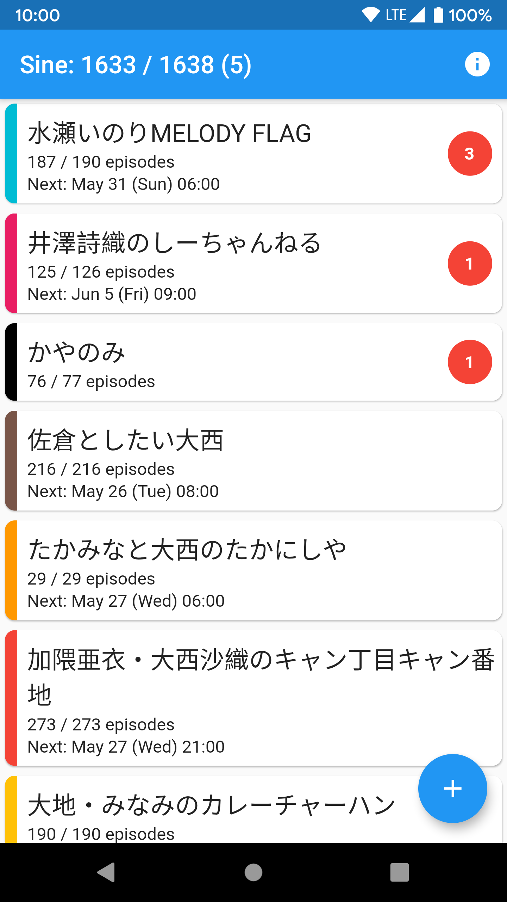
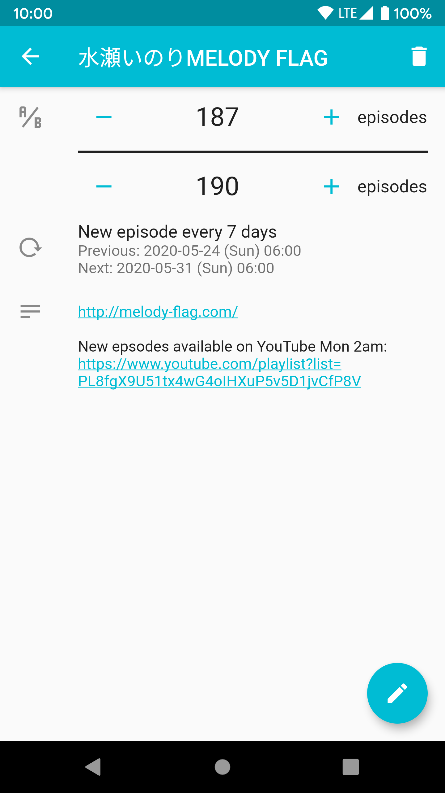
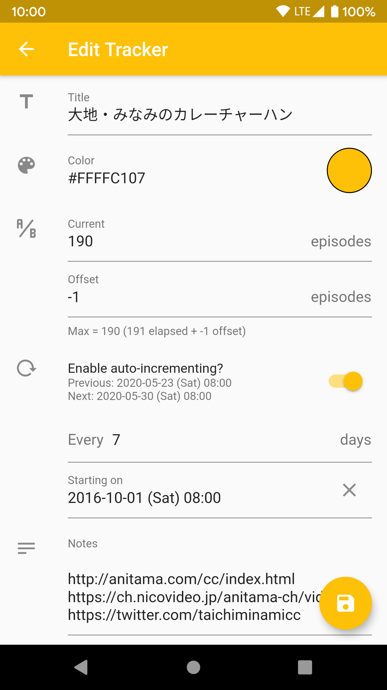

# Sine

Sine is an episode tracking app for Android, designed for keeping track of your progress on episodic content, including content which updates periodically.

## Screenshots

| List page                                   | Info page                                   | Edit page                                   |
| ------------------------------------------- | ------------------------------------------- | ------------------------------------------- |
|  |  |  |

In Sine, you create trackers to track your progress on some episodic content.
Trackers have both current and maximum number of episodes.
For auto-incrementing content, the maximum episode count is calculated based on the period (defined by a start date and frequency of updates) plus an offset.

## Installation

Download the APK file from the [latest release](https://github.com/usashiki/Eventersearch/releases/latest).
Alternatively, clone the repo and build the APK yourself with `flutter build apk`.

### Data import/export

App data is stored in the app's external storage directory, typically located at `/sdcard/Android/data/com.example.sine/files/state.json`.
To export, copy `state.json`, and to import, replace `state.json`.

## Development

Sine is written in [Dart](https://dart.dev/) using [Flutter](https://flutter.dev/).
To install Dart/Flutter, follow Flutter's [official documentation](https://flutter.dev/docs/get-started/install).

### Architecture

Sine uses [`flutter_redux`](https://pub.dev/packages/flutter_redux) for state management with [`redux_persist`](https://pub.dev/packages/redux_persist) for persistence.

The directory structure of `lib/` is as follows:

- `containers/` - the container components, eg widgets that subscribe to state provided by Redux and typically wrap a presentation widget which presents state data (unrelated to [`Container`](https://api.flutter.dev/flutter/widgets/Container-class.html))
- `models/` - the underlying data models, all of which should be JSON-serializable
- `presentation/` - the presentation components, eg widgets that render state data, typically provided by a container widget
- `redux/` - the Redux constructs, eg actions and reducers

There are no tests.

### Icon

The [app icon](assets/icon/icon.png) was created using [this image](https://commons.wikimedia.org/wiki/File:Simple_sine_wave.svg) by Omegatron [with modifications](assets/icon/sine.svg) and [Roman Nurik's](https://github.com/romannurik) [Android Asset Studio](https://romannurik.github.io/AndroidAssetStudio/index.html).

## Changelog

### v0.0.1 (2020-05-25)

Initial release.

## Roadmap

- [ ] formal data export/import
- [ ] themeing
  - [ ] dark theme
  - [ ] theme color/default tracker color selection
- [ ] delete hack (pop before load?)
- [ ] tracker/period limit (eg stops auto-incrementing after date/number of eps)
- [ ] custom page transition
- [ ] replace fabs?
- [ ] [bug] color is not set on selected fields: set theme color upon entering tracker?
- [ ] local notifications: https://pub.dev/packages/flutter_local_notifications
- [ ] timezone selection on period
- [ ] reordering trackers/custom sorting
- [ ] calendar view
- [ ] try `async_redux`? https://pub.dev/packages/async_redux
- [ ] ios support

## Meta

Written by fc ([@usashiki7](https://twitter.com/usashiki7)).
For any questions or comments, please [open an issue](https://github.com/usashiki/sine/issues/new) or contact me on Twitter (DMs open).
